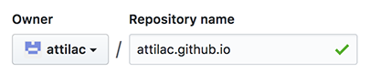
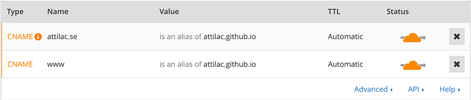
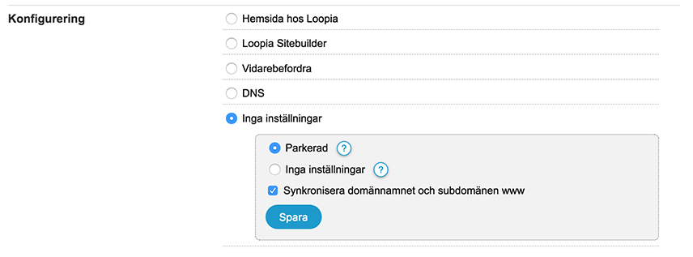
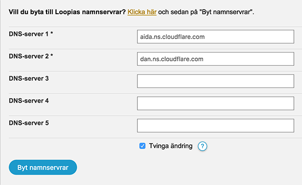
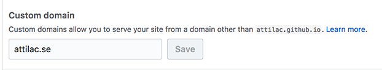

# Github Pages med Cloudfare
Kort guide hur man kopplar sin egen domän till Github Pages från Loopia genom Cloudfare

## Steg 1: Skapa ett repo med sitt användarnamn
Om man inte redan har ett, kan man skapa ett repo enligt mönstret `username.github.io`. 

Allt som pushas till master-branchen i detta repo hamnar på

`username.github.io`

Den fungerar som huvudsida till alla ens repos som har en gh-pages branch.

## Steg 2: Ställa in Cloudfare DNS 
1. Signa upp på [Cloudfare](https://www.cloudflare.com/) och [lägg till din domän](https://support.cloudflare.com/hc/en-us/articles/201720164-Step-2-Create-a-CloudFlare-account-and-add-a-website).
2. Efter att Status visar Scan Complete -> tryck på Continue Setup
3. Länka domänen till Github genom att skapar två CNAME-poster under DNS

4. Längre ner på DNS-sidan står namnet på Cloudfares namnservrar. Dessa behöver läggas i på Loopia i nästa steg.
5. För HTTPS, gå till Crypto och skrolla ner till Automatic HTTPS Rewrites. Sedan välj On. 

## Steg 3: Fyll i Cloudfares namnservrar på Loopia
1. På Loopias [kundzon](https://customerzone.loopia.se) under Domännamn, välj din domän.
2. Under Konfigurering välj Inga inställningar

3. Under Fler inställningar för `domännamn`, välj Namnservrar. Här fyller du i namnservrarna från Cloudfare

## Steg 5: Välj Custom Domain på Github
1. På din github.com/username, gå till Settings och skrolla ner till GitHub Pages
2. Under Custom domain, välj ditt domännamn

3. Vänta. Det kan ta 24 timmar innan det är klart. Man kan använda kommandot `dig domännamn.com` för att se att DNS har slagit om.

